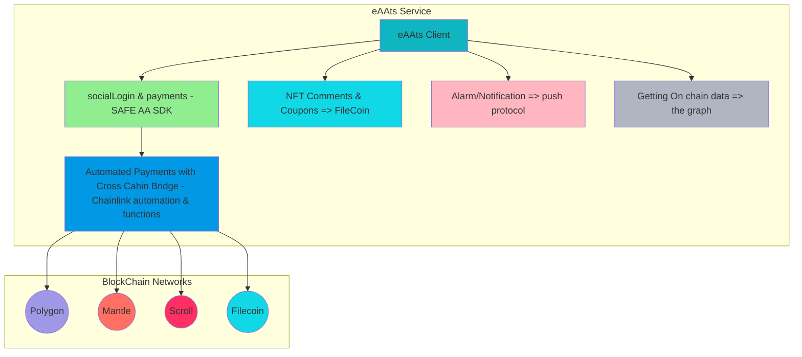

# Project Overview page
* for more information please visit our Overview Page
overview page : https://github.com/eAAts
- Tool : SAFE(AA SDK kit), Chainlink(Functions & Automation), Filecoin(IPFS- nftStorage & web3.stroage), PushProtocol, theGraph
- Network : Polygon, Mantle, Scroll, Filecoin



# eAAts

The `eAAts` is a smart contract that manages orders and payments for delivery services on the Ethereum blockchain. Here is the information of the deployed `eAAts` contract:

| Blockchain              | eAAts Address                                       |
|-------------------|--------------------------------------|
| Polygon Mainnet        | `0xb6DEa39915680d127238564F746ecBa690edd2c2` |

`eAAts` contract inherits Chainlink's Automation feature. If the payment network selected is not Polygon, `checkUpkeep` will return true. When `checkUpkeep` returns true, Chainlink nodes will execute `performUpkeep` and call `FunctionsConsumer`'s `sendRequest`. This will execute the web2 code passed as a parameter, making a payment from a wallet in another network to Polygon.

# FunctionsConsumer

`FunctionsConsumer` is a smart contract that utilizes Chainlink's Functions feature to detect order completion events and process automatic payments on the Polygon blockchain.

| Blockchain              | FunctionsConsumer Address               |
|-------------------------|-----------------------------------------------------|
| Polygon Mainnet        | `0xb6DEa39915680d127238564F746ecBa690edd2c2`                |

## Methods

### sendTokens
```solidity
function createOrder(
    uint256 _minParticipants,
    FeeType _feeType
) external returns (uint256)
```
Creates a new order with a specified minimum number of participants and fee type.

### receiveTokens
```solidity
function joinOrder(
    uint256 _orderId,
    uint256 _amount,
    uint256 _networkId
) external
```
Allows a user to join an order by contributing a specified amount.

### completeDelivery
```solidity
function completeDelivery(uint256 _orderId) external;
```
Marks an order as completed (delivery done) and handles the fee distribution.

### checkUpkeep
```solidity
function checkUpkeep(
    bytes calldata checkData
) external returns (bool upkeepNeeded, bytes memory performData)
```
Checks if the upkeep is needed based on the specified conditions in the contract.

### checkUpkeep
```solidity
function performUpkeep(
    bytes calldata performData
) external
```
Performs the necessary upkeep if the conditions are met.

## Prerequisites
- Node.js v14+ LTS and npm (comes with Node)
- Hardhat

## Installation
Clone the repository:

```bash
git clone https://github.com/eAAts/eAAts.git
```

Navigate to the project folder:
```bash
cd eAAts
```

Install dependencies:
```bash
npm install
```

## Set up configuration:
1. Review the `.example.env` file.
2. Create a `.env` file based on the example and adjust the values as needed.

For Linux or macOS:
```bash
cp .example.env .env
```

For Windows:
```bash
copy .example.env .env
```

## Compilation
Compile the smart contracts using Hardhat:
```bash
npx hardhat compile
```

## Quick Start Guide
### 1. Testing:
Run the following command to execute the contract tests. Make sure you've written the tests in your Hardhat project's `test` directory.
```bash
npx hardhat test
```

### 2. Deployment:
To deploy the `FunctionsConsumer` and `eAAts` contracts, follow these steps:

Deploy `FunctionsConsumer` to polygon network:
```bash
npx hardhat run scripts/deploy_consumer.js --network polygon
```

Deploy `eAAts` to polygon network:
```bash
npx hardhat run scripts/deploy_eAAts.js --network polygon
```

## Conclusion
If you would like to contribute to the project, please fork the repository, make your changes, and then submit a pull request. We appreciate all contributions and feedback!
